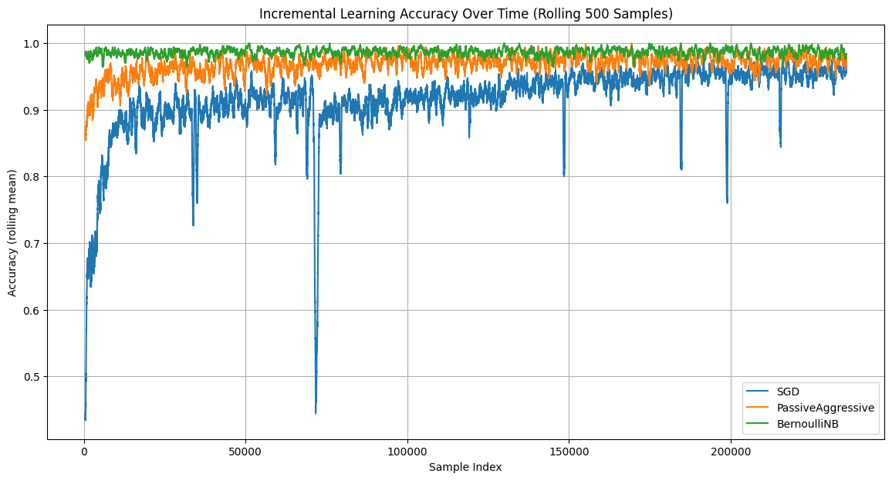
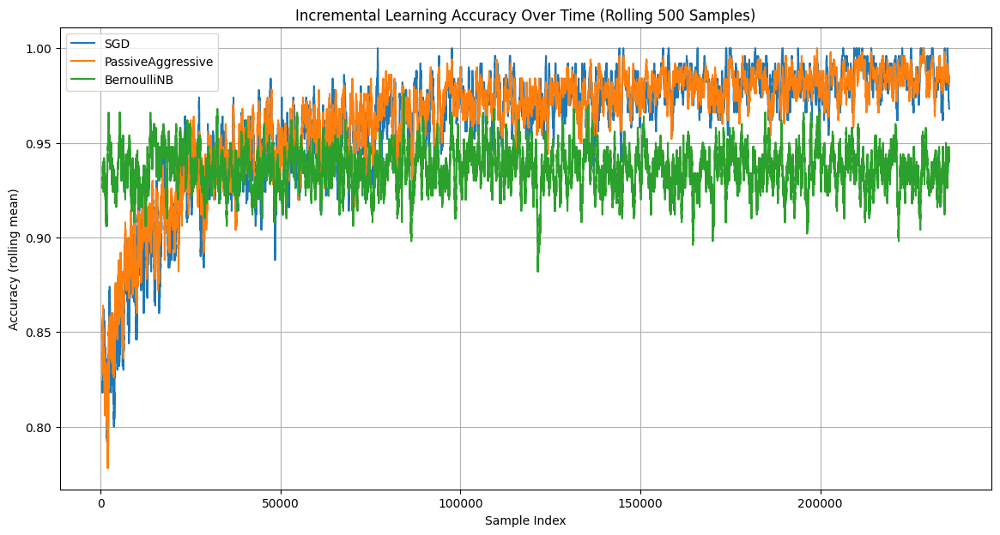

# **Comparing Full-Feature and Pre-Fetch ML Models for Phishing Detection: Baselines, Few-Shot Learning, and Incremental Updates**

Phishing URL detection can be approached in many ways, ranging from lightweight lexical analysis to heavier page-content inspection. In practice, the safest and most deployable methods are those that rely **only on the URL itself**, without fetching the webpage or executing any scripts. URL-based models operate pre-click, avoid the risks of loading unknown content, and offer low-latency predictions suitable for real-time filtering.

The PHIUSIIL dataset includes both **pre-fetch URL-derived features** (length, character- and token-level statistics, obfuscation patterns, TLD information, probability lookups, keyword indicators, etc.) and **post-fetch webpage/content features** that require actually loading the page (e.g., LineOfCode, Robots.txt access, responsiveness, number of CSS files). This makes it possible to directly compare safe URL-only approaches against full-content models.

While full-feature models serve as an upper performance bound, the primary question this project investigates is:

### **How well can we classify phishing attempts using only URL-based features that are safe, instantaneous, and do not require fetching the webpage?**

The results show that URL-only models achieve performance surprisingly close to the full-feature baselines—making them highly practical for pre-click phishing prevention without relying on webpage retrieval or dynamic content inspection.

# ⭐ Results Summary

| Experiment Type                                   | Best Model          | Accuracy |
|---------------------------------------------------|----------------------|----------|
| 70/30 Stratified Train–Test Split                 | Decision Tree / RF   | **1.0000** |
| Few-Shot Learning (1% - 50% Training Data)        | Decision Tree        | **1.0000** |
| Incremental Learning (All Numeric Features)       | BernoulliNB          | **0.9865** |
| Incremental Learning (URL-Only Features)          | Passive-Aggressive   | **0.9619** |

# **Dataset Citation**

> [PhiUSIIL Phishing URL (Website) - UCI Machine Learning Repository](https://archive.ics.uci.edu/dataset/967/phiusiil+phishing+url+dataset)

# **Introductory Paper**

> Arvind Prasad, Shalini Chandra, “PhiUSIIL: A diverse security profile empowered phishing URL detection framework based on similarity index and incremental learning.” 2024.
> [https://linkinghub.elsevier.com/retrieve/pii/S0167404823004558](https://linkinghub.elsevier.com/retrieve/pii/S0167404823004558)

# **Dataset Overview**

The **PHIUSIIL Phishing URL Dataset** contains 235795 instances of URLs, each represented by **54 features** and a **binary label** indicating whether the URL corresponds to a legitimate URL (`1`) or a phishing URL (`0`).

### **Feature Types**

* The PHIUSIIL dataset contains both **pre-fetch URL features** and **post-fetch webpage content features**, which together provide a very strong signal for phishing detection.
* Examples of pre-fetch URL Features include **URL length**, **domain length**, **Character-level patterns** and **HTTPS flag**.
* Examples of post-fetch Features that are based on the content of the website include **Favicon presence**, **Redirect counts**, **Responsiveness flag** and **External form submit, hidden fields, password fields**.
* Labels have a moderate class skew (~42.8% phishing vs ~57.2% legitimate), but remain suitable for both ROC-AUC and standard accuracy-based evaluation.


# **Approach 1: Baseline Models**

Because the dataset includes many high-signal post-fetch features (HTML structure, JavaScript behaviors, DOM statistics, redirect metadata, etc.), classical models receive extremely discriminative information that makes the classes almost perfectly separable.

## **Results (Full Metrics)**

| Model               | Accuracy     | Precision    | Recall       | F1 Score     | ROC-AUC      |
| ------------------- | ------------ | ------------ | ------------ | ------------ | ------------ |
| Logistic Regression | 0.999901     | 0.999901     | 0.999926     | 0.999913     | 0.999999     |
| Decision Tree       | **1.000000** | **1.000000** | **1.000000** | **1.000000** | **1.000000** |
| Random Forest       | **1.000000** | **1.000000** | **1.000000** | **1.000000** | **1.000000** |
| Extra Trees         | 0.999972     | 0.999951     | **1.000000** | 0.999975     | **1.000000** |

These results confirm that the PHIUSIIL dataset is fully separable with classical models when all features are available, providing a benchmark against which more constrained scenarios—few-shot learning, incremental learning, and URL-only models—can be compared.

# **Approach 2: Few-Shot Learning (1% → 50% Training Data)**

To evaluate how well classical models perform when training data is extremely limited, I repeated the baseline experiments using **only a small fraction of the training set**, while keeping the **same 30% test set** as in the baseline. I tested 1%, 5%, 10%, 20%, 30%, 40%, and 50% of the training data using the same four models used in the baselines. Although the full table is very large, the **best model for each data fraction** is summarized below.

## **Best Models per Few-Shot Ratio**

| Training Fraction | Best Model                    | Accuracy     | Precision    | Recall       | F1 Score     | ROC-AUC      |
| ----------------: | ----------------------------- | ------------ | ------------ | ------------ | ------------ | ------------ |
|            **1%** | Random Forest                 | 0.999915     | 0.999876     | 0.999975     | 0.999926     | 0.999905     |
|            **5%** | Random Forest                 | 0.999929     | 0.999876     | 1.000000     | 0.999938     | 0.999917     |
|           **10%** | Decision Tree                 | **1.000000** | **1.000000** | **1.000000** | **1.000000** | **1.000000** |
|           **20%** | Random Forest                 | 0.999986     | 0.999975     | 1.000000     | 0.999988     | 0.999983     |
|           **30%** | Decision Tree / Random Forest | 0.999972     | 0.999951     | 1.000000     | 0.999975     | 0.999967     |
|           **40%** | Random Forest                 | 0.999986     | 0.999975     | 1.000000     | 0.999988     | 0.999983     |
|           **50%** | Decision Tree / Random Forest | 0.999986     | 0.999975     | 1.000000     | 0.999988     | 0.999983     |

Even under severe data scarcity, the PHIUSIIL dataset remains highly separable. With only 10% of the training data, the Decision Tree already achieves perfect accuracy, precision, recall, F1, and ROC-AUC, matching the full-data baseline. This demonstrates that even small subsets of the dataset contain enough discriminative signal for near-perfect phishing detection, highlighting the robustness and strong feature engineering of the dataset.

# **Approach 3: Incremental Learning (Prequential Evaluation)**

To simulate a real-world streaming environment—where new URLs arrive continuously and the model must update itself on the fly—I evaluated **incremental learning algorithms** using a **prequential (predict-then-update)** strategy. Each model was initialized with a small seed set (25 samples per class), then exposed to the full shuffled dataset one instance at a time.

Unlike the baselines, incremental models:

* see **one sample at a time**
* must **predict first**, then receive the true label
* update online using `partial_fit`
* never revisit past samples

## **Results (Prequential Accuracy)**

| Model              | Incremental Accuracy |
| ------------------ | -------------------- |
| SGDClassifier      | 0.915812             |
| Passive-Aggressive | 0.968490             |
| **BernoulliNB**    | **0.986518**         |

## **Prequential Evaluation Curve**



Incremental learners perform remarkably well despite the strict one-pass constraint. **Bernoulli Naive Bayes achieves 98.65% accuracy**, demonstrating that a lightweight, streaming-compatible classifier can still achieve near-baseline performance without accessing the full dataset at once.

# **Approach 4: Incremental Learning (URL-Only Features)**

While the PHIUSIIL dataset contains many powerful **post-fetch features** (HTML structure, JavaScript behaviors, page metadata, redirects, forms, etc.), these attributes require **fully loading the webpage**. In real-world security systems, this is often **too slow or too risky**—a phishing URL may need to be classified *before* any page content is fetched.

To explore this constraint, I isolated a feature subset containing only **pre-fetch information** derived solely from the URL string, its domain, character ratios, TLD statistics, and lexical patterns. These features can be computed the moment an email, SMS, or browser encounters a URL—**with no network request required**.

Using this restricted feature set, I repeated the incremental learning experiment with the same prequential setup.

## **Results (Prequential Accuracy)**

| Model              | Incremental Accuracy |
| ------------------ | -------------------- |
| SGDClassifier      | 0.960309             |
| Passive-Aggressive | 0.961865             |
| BernoulliNB        | 0.936093             |

## **Prequential Evaluation Curve**



Despite losing all HTML/DOM/JavaScript–based signals, the models still achieve **93–96% accuracy** in a pure streaming, URL-only setting.

# **Conclusion**

Across all four experimental settings, the PHIUSIIL dataset proves to be **highly separable**, even under severe constraints. The baseline models achieve near-perfect performance, establishing an extremely high upper bound. Yet even when the available training data is drastically reduced (Approach 2), tree-based models maintain **>99.9% accuracy** with as little as **1–5%** of the dataset — showing that few-shot learning remains highly viable.

In more realistic streaming conditions (Approach 3), where the model must predict before seeing the true label and can only update once per sample, incremental learners still perform well. Bernoulli Naive Bayes reaches **98.65% accuracy**, demonstrating that simple, lightweight algorithms can remain competitive under strict one-pass constraints.

Finally, even when restricted to **pure URL-only, pre-fetch features** (Approach 4), incremental learners achieve **93–96% accuracy**, confirming that a large portion of phishing signal is encoded directly in the lexical structure of the URL itself. This makes fast, safe, phishing detection feasible without loading the webpage — crucial for email clients, browsers, and endpoint security systems.

Overall, the experiments show that phishing URLs in this dataset can be **reliably identified across baseline, few-shot, incremental, and URL-only scenarios**, providing a strong foundation for both high-performance batch models and lightweight, deployable streaming detectors.

# **How to Use This Repository**

### **1. Install dependencies**

```bash
pip install -r requirements.txt
```

### **2. Run the notebooks in order**

```
01_EDA.ipynb  
02_Baseline.ipynb
03_FewShot_Baseline.ipynb
04_Incremental_Learning.ipynb
05_Incremental_Pre_Fetch.ipynb
```

* **01_EDA** — dataset exploration, distributions, correlations
* **02_Baseline** — initial model comparison using a stratified train/test split
* **03_FewShot_Baseline** — same models as the baseline trained using a fraction of the training data
* **04_Incremental_Learning** — incremental learning approach
* **05_Incremental_Pre_Fetch** — incremental learning approach using features derived solely from the URL string, its domain, character ratios, TLD statistics, and lexical patterns 